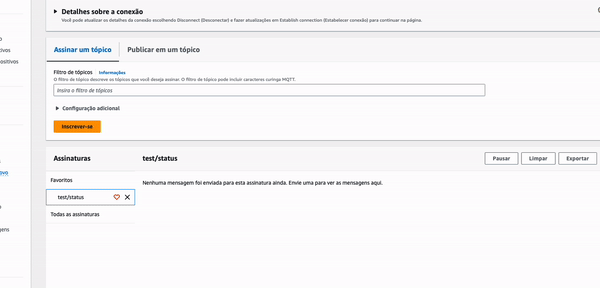

### Descrição do Projeto

Este é um projeto de demonstração que exemplifica o funcionamento da integração com o AWS IoT Core usando Python para publicação e assinatura de mensagens. O projeto apresenta uma aplicação simples para controle remoto de dispositivos conectados à plataforma IoT.

Não está sincronizada, mas é assim que a AWS recebe os dados.

Nesta imagem animada, você pode visualizar uma representação gráfica da troca de mensagens entre dispositivos IoT e o AWS IoT Core. A aplicação Python realiza a publicação de dados de sensores (simbolizados pelas setas verdes) e a assinatura para receber comandos de controle (simbolizados pelas setas azuis).

A integração com o AWS IoT Core permite que dispositivos e aplicativos troquem informações em tempo real com a nuvem, viabilizando soluções IoT inteligentes e escaláveis.

A imagem acima demonstra o projeto em execução, com os dispositivos enviando e recebendo dados na plataforma IoT, e representa uma solução prática e funcional da aplicação proposta.

## O que é "coisa" na IoT?

"Coisa" é uma tradução em português para a palavra em inglês "Thing". Em relação ao AWS IoT Core, uma "coisa" (ou "Thing") é uma entidade virtual que representa um dispositivo físico ou um aplicativo conectado à plataforma de Internet das Coisas (IoT).

Em termos gerais, em contextos de IoT, uma "coisa" pode se referir a qualquer objeto, dispositivo, sensor, máquina ou até mesmo um software que pode ser conectado à internet ou a uma rede local para coletar e trocar dados com outros sistemas.

Por exemplo:

- Uma "coisa" pode ser um sensor de temperatura que mede a temperatura ambiente e envia os dados para a nuvem para análise e monitoramento.
- Uma "coisa" pode ser um dispositivo de iluminação inteligente que pode ser controlado remotamente através de um aplicativo.
- Uma "coisa" pode ser um medidor de energia elétrica inteligente que registra o consumo de energia e envia os dados para uma central de gerenciamento.

A utilização do termo "Thing" em inglês é muito comum em contextos de Internet das Coisas, pois muitas das tecnologias, padrões e plataformas relacionadas à IoT são desenvolvidas em inglês. Portanto, a expressão "Thing" é frequentemente usada internacionalmente para se referir a essa entidade virtual genérica que representa um dispositivo ou aplicativo conectado à IoT.

## Importância da Etapa de Criar uma "Coisa" no AWS IoT Core

A etapa de criar uma "coisa" no AWS IoT Core é crucial para o funcionamento e gerenciamento eficiente do ecossistema IoT. Uma "coisa" é a representação virtual de um dispositivo, sensor ou aplicativo que se conecta à plataforma de IoT. Ao criar uma "coisa", estamos estabelecendo uma entidade única e identificável dentro do ambiente de nuvem da AWS IoT.

Aqui estão algumas razões pelas quais essa etapa é importante:

1. **Identificação e Rastreamento:** A criação de uma "coisa" fornece uma identidade única e rastreável para cada dispositivo ou aplicativo IoT. Isso permite que a AWS IoT Core gerencie, acompanhe e interaja individualmente com cada entidade.

2. **Autenticação e Segurança:** Cada "coisa" criada é associada a um certificado para autenticação. Isso garante que apenas dispositivos autorizados possam se conectar à AWS IoT Core e trocar dados com segurança.

3. **Políticas de Acesso:** Ao criar uma "coisa", é possível associar políticas de acesso específicas a ela. Essas políticas definem quais ações a "coisa" pode realizar no AWS IoT Core, permitindo um controle granular sobre os recursos acessíveis.

4. **Organização e Agrupamento:** A possibilidade de agrupar "coisas" facilita a organização e gerenciamento de dispositivos semelhantes ou pertencentes a um mesmo grupo. Isso é especialmente útil em sistemas com muitos dispositivos IoT.

5. **Monitoramento e Análise:** A criação de "coisas" facilita a coleta de dados e o monitoramento de dispositivos individuais. Isso permite análises detalhadas, detecção de problemas e otimização de desempenho.

Em suma, criar uma "coisa" no AWS IoT Core é uma etapa essencial para estabelecer uma infraestrutura sólida de Internet das Coisas. Com identificação única, segurança aprimorada e controle personalizado, as "coisas" permitem a implementação bem-sucedida de soluções IoT escaláveis, confiáveis e seguras na nuvem da AWS.

### Como criar uma coisa (Thing) no AWS IoT Core

1. **Acessar o Console da AWS:**
   Faça login na sua conta da AWS e acesse o [Console da AWS](https://console.aws.amazon.com/).

2. **Navegar até o AWS IoT Core:**
   No Console da AWS, pesquise por "IoT Core" na barra de pesquisa e clique em "AWS IoT Core" nos resultados.

3. **Criar uma "Coisa" (Thing):**
   No painel de controle do AWS IoT Core, clique em "Things" (Coisas) no menu lateral esquerdo e, em seguida, clique em "Create" (Criar).

4. **Configurar a "Coisa" (Thing):**
   No formulário de criação, você precisará fornecer alguns detalhes para configurar a coisa, como:

   - **Name:** Dê um nome significativo para a coisa.
   - **Type:** Escolha o tipo de coisa que você está criando (opcional).
   - **Group:** Opcionalmente, você pode adicionar a coisa a um grupo específico.
   - **Additional attributes:** Adicione atributos adicionais, se necessário (opcional).

5. **Definir Política (Policy):**
   A próxima etapa é definir uma política para a coisa, que especifica quais ações ela pode realizar no AWS IoT Core. Você pode selecionar uma política existente ou criar uma nova política.

6. **Criar ou associar Certificado (Certificate):**
   Cada coisa no AWS IoT Core precisa ter um certificado para se autenticar. Se você já possui um certificado, pode associá-lo à coisa. Caso contrário, você precisará criar um novo certificado.

7. **Baixar os arquivos do Certificado:**
   Depois de criar ou associar um certificado, é importante baixar os arquivos do certificado (chave privada, certificado e certificado raiz da autoridade certificadora) para configurar a coisa corretamente.

8. **Concluir a Criação:**
   Após configurar todos os detalhes e associar o certificado, clique em "Create thing" (Criar coisa) para criar a coisa no AWS IoT Core.

9. **Testar a Coisa (Thing):**
   Agora que você criou a coisa, você pode testá-la usando os tópicos MQTT para publicar e receber mensagens.

10. **Integrar a Coisa (Thing):**
   A última etapa é integrar a sua coisa ao seu aplicativo ou sistema IoT. Dependendo do tipo de dispositivo, você precisará usar bibliotecas ou SDKs compatíveis com a linguagem de programação do dispositivo para se comunicar com o AWS IoT Core.

Lembre-se de que os detalhes exatos do processo podem mudar ligeiramente ao longo do tempo, pois a AWS continua aprimorando seus serviços. Portanto, é recomendável consultar a [documentação oficial da AWS IoT Core](https://aws.amazon.com/iot-core/) para obter as informações mais atualizadas.